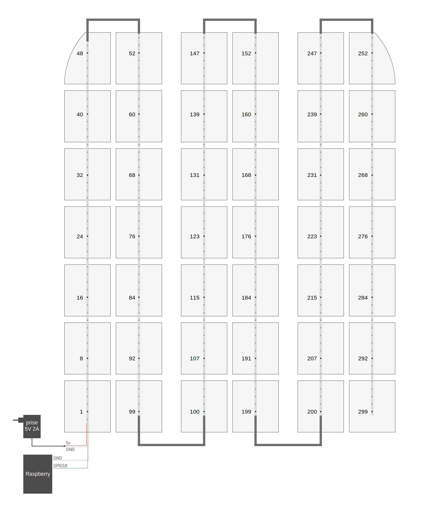

# leds-play

Fun with LEDs & Raspberry

## Idée

- Mettre des LEDs derrière les carreaux de cette paroi vitrée dans mon appart pour en faire un écran de 6x7 px.  
  
- Pouvoir contrôler le programme avec un contrôleur Bluetooth ou une app web sur téléphone.
- Idées de programmes:
  - [x] Message défilant
  - [x] Afficher une image
  - [x] Afficher un gif
  - [ ] Snake
  - [ ] Pong
  - [ ] Tetris
  - [ ] Crazy Taxi
  - [ ] Flappy Bird
  - [ ] Réaction à la musique
  - [ ] Un détecteur de mouvement qui allume les LEDs

## Matériel

- Raspberry Pi
- LEDs addressables: 2 x [bandes NeoPixel de 5m](https://www.bastelgarage.ch/rouleau-de-bande-led-neopixel-ws2812b-de-5m-30led-m?search=421328)
- Fil: [Câble 3x0.25mm²](https://www.bastelgarage.ch/cable-3x0-25mm-awg24-gris-liyy?search=420539)
- Alimentation:
  - [Adaptateur secteur 5V 2A](https://www.bastelgarage.ch/adaptateur-secteur-ac-dc-5v-dc-2000ma-prise-5-5mm-2-1mm?search=422326)
  - [Connecteur Barrel Jack](https://www.bastelgarage.ch/prise-dc-femelle-barrel-jack-5-5mm-2-1mm-avec-bornes-a-vis?search=420128)
  - [Condensateurs](https://www.bastelgarage.ch/condensateur-electrolytique-1000-f-25-v?search=420416)
- Contrôleurs Bluetooth: 2 x [Zero 2](https://www.8bitdo.com/zero2/)

## Développement

Créer un venv:

```sh
python -m venv venv
```

L'activer:

```sh
source venv/bin/activate
```

Créer le fichier de config:

```sh
cp config.py.example config.py
```

Deux drivers à choix dans `config.py`: "pygame" et "neopixel". 

### Driver pygame

À utiliser pour le développement

```sh
pip install -r drivers/pygame/requirements.txt
```

<video src="https://github.com/user-attachments/assets/5225aeb9-31cc-484a-9133-a43038fde24b"></video>

### Driver neopixel

Utilisable seulement sur le Raspberry.

```sh
pip install -r drivers/neopixel/requirements.txt
```


Pour manipuler les LEDs, on doit être admin, donc lancer python en sudo. Mais on ne peut pas faire ça lorsqu'un est dans un venv. Donc on doit cibler l'exécutable de python dans le venv:

```sh
sudo venv/bin/python main.py
```

## Dépendances

- Communes:
  - [InquirerPy](https://inquirerpy.readthedocs.io/en/latest/index.html)
  - [websockets](https://websockets.readthedocs.io/en/stable/index.html)
- Driver pygame:
  - [pygame](https://www.pygame.org/docs/)
- Driver neopixel:
  - [Adafruit CircuitPython NeoPixel](https://docs.circuitpython.org/projects/neopixel/en/latest/)
  - [evdev](https://python-evdev.readthedocs.io/en/latest/)

## Contrôleurs

La gestion des inputs est différente en fonction du driver.

### Sur Raspberry / driver neopixel

Sur le Raspberry on utilise evdev (Linux seulement) pour se connecter aux contrôleurs Bluetooth.

Pour appairer un contrôleur:

```sh
bluetoothctl
scan on
# liste des appareils détectés
Device E4:17:D8:88:14:47 8BitDo Zero 2 gamepad
scan off
# appairer et connecter
pair E4:17:D8:88:14:47
trust E4:17:D8:88:14:47
connect E4:17:D8:88:14:47
quit
```

Identification des devices:

```sh
cat /proc/bus/input/devices
```

On apprend qu le Zero 2 est géré par le device "event2".

Tester les devices:

```sh
sudo apt install evtest
sudo evtest
```

### Driver pygame

Les contrôleurs sont gérés par [pygame.joystick](https://www.pygame.org/docs/ref/joystick.html) ou [pygame.key](https://www.pygame.org/docs/ref/key.html) en fonction de ce qui est configuré dans `config.py`.

Pour que les événements soient déclenchés, il faut que la fenêtre de Pygame soit active.

#### Mode manette

Lorsque `config.controller` est `"gamepad"`.

Pygame reconnaît automatiquement les manettes bluetooth (ou usb) connectées à l'ordinateur.

#### Mode clavier

Lorsque `config.controller` est `"keyboard"`.

On utilise le clavier comme contrôleur, avec ces correspondances:

- Touches fléchées: croix directionnelle
- W,A,S,D: boutons d'actions
- Q,E: gachettes
- espace, backspace: select
- space, enter: start

Ce mode ne permet pas de gérer plusieurs contrôleurs.

## Interface web pour le son

J'ai abandonnée l'idée de produire du son directement par le Raspberry. Rien ne marche: Le port jack crée des interférence avec les LEDs et fait tout crasher; une carte son produit un son pourri; connecter une enceinte bluetooth est un cauchemar... Bref j'ai abandonné.

Après ces déconvenues voici la solution overkill:
- Le programme Python crée un serveur WebSockets.
- Les noms de fichier des sons sont envoyés aux clients au moment où ils doivent être joués.
- Une page web `web/index.html` est ouverte depuis un autre appareil, un ordinateur ou un téléphone.
- La page permet de se connecter au serveur WebSocket.
- Lorsque la page reçoit le nom d'un fichier, elle joue l'audio.

Installer les dépendances web:

```
npm install --prefix web
```

Et lancer l'app:

```
npm run dev --prefix web
```

Cette interface web pourrait être utilisée par la suite pour afficher l'état des LEDs et remplacerait le driver pygame.

## Montage

Schéma de montage:



Chaque colonne contient une bande de 50 LEDs. Donc il y a 300 LEDs en tout. Les LEDs sont espacées de 3.333 cm, une bande de 50 fait donc 166.666 cm. Les bandes sont câblées en série. J'utilise une alimentation externe de 2 Ampères / 5 Volts pour économiser la charge du Raspberry. Si on voulait allumer toutes les LEDs à pleine puissance, il faudrait ajouter une deuxième alim qui alimente les 3 dernières bandes.

On n'utilise qu'une LED par carreau donc environ une sur huit. Le schéma est vu depuis l'arrière de la paroi donc l'axe horizontal est inversé: La LED pour le premier carreau (en haut à gauche) est la 252. 
Le fichier [drivers/neopixel/matrix.py](drivers/neopixel/matrix.py) est utilisé pour faire la correspondance coordonnées du carreau -> index de la LED.

## Connexion SSH au Raspberry

```sh
ssh pi@192.168.1.116
# mot de passe
cd leds-play
sh run.sh
```
